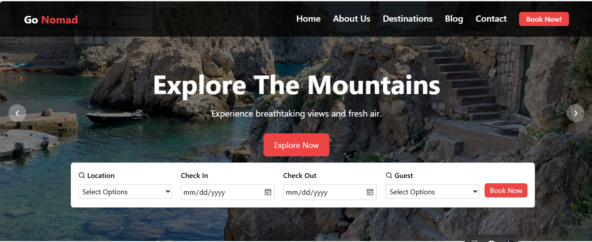
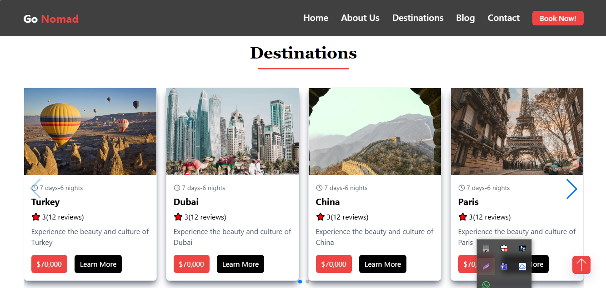
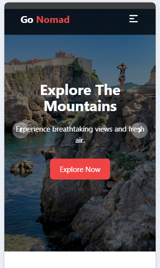

# 🌍 Travel Website – React Project

A modern **travel destination website** built with **React and Tailwind CSS**.
The website showcases beautiful travel destinations, interactive UI components, and a responsive design that works across all devices.

This project was built to strengthen my **frontend development skills** and practice building real-world user interfaces using React.

---

## 🚀 Live Demo

🔗 https://your-vercel-link.vercel.app

--- 

## 📌 Features

* Responsive modern UI
* Travel destinations showcase
* Image gallery with lightbox slider
* Smooth scrolling sections
* Interactive navigation menu
* Clean and reusable React components
* Optimized layout for desktop and mobile

---

## 🛠️ Tech Stack

**Frontend**

* React
* JavaScript (ES6+)
* Tailwind CSS
* HTML5
* CSS3

**Libraries**

* React Router
* LightGallery
* React Icons / Lucide Icons

---

## 📂 Project Structure

```
travel-website-react
│
├── public
│
├── src
│   ├── assets
│   ├── components
│   ├── pages
│   ├── App.jsx
│   └── main.jsx
│
├── package.json
└── README.md
```
---

## 🌐 Deployment

This project is deployed using **Vercel**.

---

## 📸 Screenshots

### Homepage


### Destinations Section


### Mobile View


---

## 🎯 Learning Goals

Through this project I practiced:

* Component-based architecture in React
* Responsive UI development
* Working with third-party libraries
* Managing project structure
* Deploying React applications

---

## 👨‍💻 Author

**Anoosh Salman**

* GitHub: https://github.com/anooshsalman10

